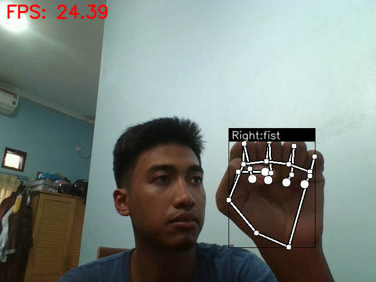
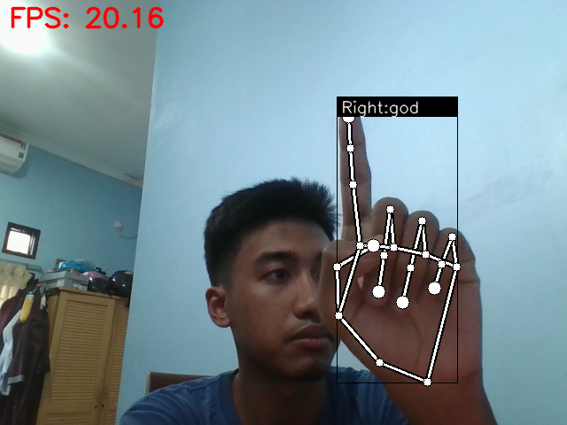
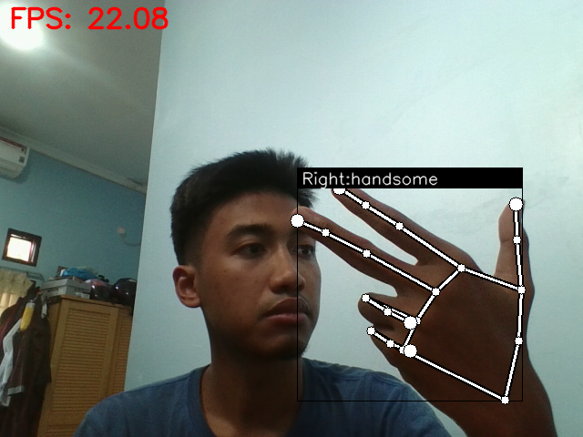
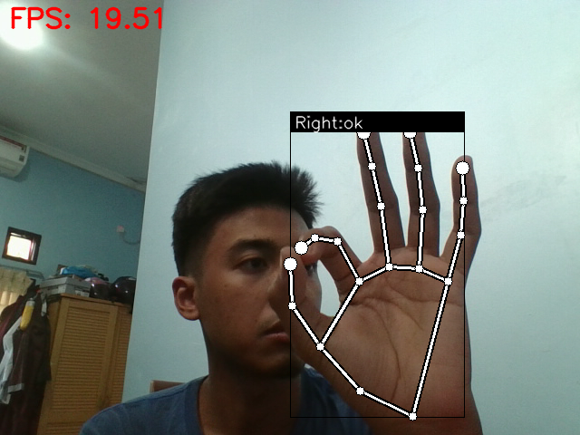
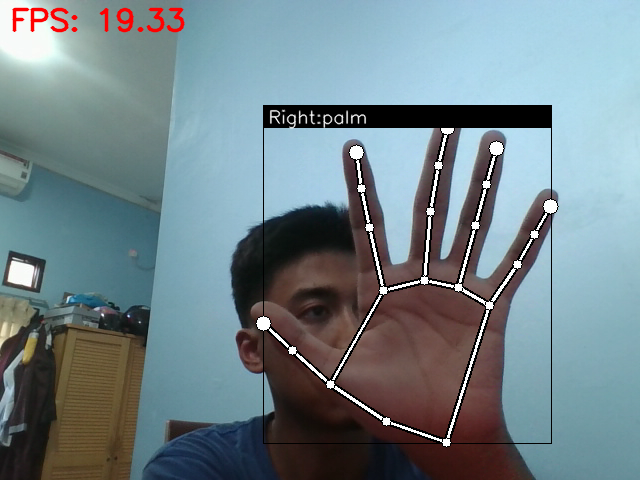
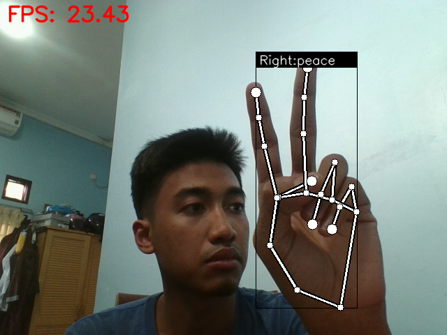
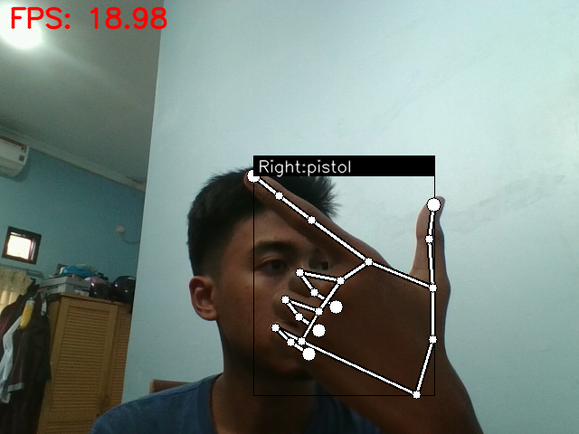
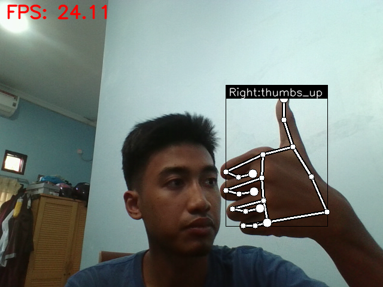
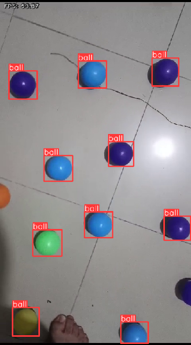

# Inamarine Vision Gesture

## Introduction

These projects is a part of the Inamarine 2024 project. The Inamarine 2024 is an exhibition event that will be held in Jakarta, Indonesia. The event will showcase the latest technology in the maritime industry. The Inamarine Vision contains two projects, the Inamarine Vision Gesture and the Inamarine Vision Object Detection. The Inamarine Vision Gesture project is a project that can recognize hand gestures using the MediaPipe library. The Inamarine Vision Object Detection project is a project that can detect buoys using YOLOv5. The weights file originally is on `.pt` format, but it has been converted to `.bin` and `.xml` (OpenVINO format) for Intel NUC compatibility. 

## Installation

### General

To install the Inamarine Vision project general requirements, you need to follow the steps below:

1. Create ROS2 workspace

```bash
mkdir -p ~/ros2_ws/src
cd ~/ros2_ws/src
```

2. Clone the repository

```bash
git clone https://github.com/Barunastra-ITS/inamarine-vision
```

3. Install the dependencies

```bash
pip install -r requirements.txt
sudo apt install ros-humble-vision-msgs
```

4. Build the project

```bash
cd ~/ros2_ws
colcon build
```

5. Source the project

```bash
source ~/ros2_ws/install/setup.bash
```

## Vision Gesture

To install the Inamarine Vision Gesture project, you need to follow the steps below:

1. Move the weights file and the label file to the build directory

```bash
cp ~/ros2_ws/src/vision_gesture/vision_gesture/model/keypoint_classifier_8_class.tflite ~/ros2_ws/build/lib/vision_gesture/model/
cp ~/ros2_ws/src/vision_gesture/vision_gesture/model/keypoint_classifier_label.csv ~/ros2_ws/build/lib/vision_gesture/model/
```

2. Change the label directory in the `vision_gesture.py` file

```python
with open('{your_home_directory}/ros2_ws/build/vision_gesture/build/lib/vision_gesture/model/keypoint_classifier_label.csv', encoding='utf-8-sig') as f:
            self.keypoint_labels = [row[0] for row in csv.reader(f)]
```

3. And the weights file directory at `model/keypoint_classifier.py`

```python
def __init__(
        self,
        model_path='{your_home_directory}/ros2_ws/build/vision_gesture/build/lib/vision_gesture/model/keypoint_classifier_8_class.tflite',
        num_threads=1,
    ):
```

### Vision Object Detection

To install the Inamarine Vision Object Detection project, you need to follow the steps below:

1. Install OpenVINO toolkit version 2023.0.2 from [here](https://docs.openvino.ai/archive/2023.0/openvino_docs_install_guides_installing_openvino_from_archive_linux.html) and also install from pip for the OpenVINO Python API.

```bash
pip install openvino-dev==2023.0.2
```

2. Move the weights file and the label file to the build directory. There are 2 different trained weights, SGD and Adam. You can choose one of them. 

```bash
cp ~/ros2_ws/src/yolov5/yolov5/trained/yolov5n_adam ~/ros2_ws/build/lib/yolov5/trained/ # for Adam
cp ~/ros2_ws/src/yolov5/yolov5/trained/yolov5n_SGD ~/ros2_ws/build/lib/yolov5/trained/ # for SGD
```

3. Change the weights file directory in the `detect.py` file

```python
self.weights = '{your_home_directory}/ros2_ws/build/yolov5/build/lib/yolov5/trained/yolov5n_{adam_or_SGD}/yolov5n_yolov5n_{adam_or_SGD}_openvino_model/' 
```

4. Change the label file directory in the `detect.py` file

```python
self.data = '{your_home_directory}/ros2_ws/build/yolov5/build/lib/yolov5/trained/yolov5n_{adam_or_SGD}/yolov5n_yolov5n_{adam_or_SGD}_openvino_model/yolov5n_{adam_or_SGD}.yaml'
```

## Usage

### Vision Gesture

To use the Inamarine Vision Gesture project, just run the `vision_gesture.py` file.

```bash
cd ~/ros2_ws
ros2 run vision_gesture vision_gesture
```

### Vision Object Detection

To use the Inamarine Vision Object Detection project, just run the `detect.py` file.

```bash
cd ~/ros2_ws
ros2 run yolov5 detect
```

## Topics

### Gesture Recognition

- `/gesture_recognition` (std_msgs/String)

### Object Detection

- `/inference/image_raw` (sensor_msgs/Image)
- `/inference/object_raw` (yolo_msgs/msg/BoundingBoxArray)

## Messages

### Gesture Recognition

- `String` (std_msgs/String)

### Object Detection

#### Built-in

- `String` (std_msgs/String)
- `BoundingBox2D` (vision_msgs/msg/BoundingBox2D)
- `Image` (sensor_msgs/msg/Image)
- `Header` (std_msgs/msg/Header)

#### Custom

- `BoundingBox` (yolo_msgs/msg/BoundingBox)
    - `string` class_name
    - `vision_msgs/BoundingBox2D` bounding_box
- `BoundingBoxArray` (yolo_msgs/msg/BoundingBoxArray)
    - `std_msgs/Header` header
    - `BoundingBox[]` bounding_box_array

## Example

### Gestures List

The Inamarine Vision Gesture project can recognize 8 hand gestures. The gestures are:

<!-- table -->
| Class Name     | Class ID | Example                                                              |
| :---:          | :---:    | :---:                                                                |
| fist           | 0        |            |
| god            | 1        |     |
| handsome       | 2        |            |
| ok             | 3        |       |
| palm           | 4        |       |
| peace          | 5        |     |
| pistol         | 6        |  |
| thumbs_up      | 7        |   |

### Objects List

The Inamarine Vision Object Detection project can only recognize 1 object. The object is:

<!-- table -->
| Class Name     | Class ID | Example                                                              |
| :---:          | :---:    | :---:                                                                |
| buoy           | 0        |            |

## Known Issues

- In Inamarine Vision Object Detection, if you do inference to a video file with CPU, you should change the model shape from `(1, 3, 640, 640)` to `(1, 3, 480, 640)`. You can change the model shape using `export.py` file. 

    - Modify the `export.py` file

    ```python
    def parse_opt(known=False):
    ...
        parser = argparse.ArgumentParser()
        ...
        parser.add_argument("--imgsz", "--img", "--img-size", nargs="+", type=int, default=[640, 640], help="image (h, w)") # change the default value to [480, 640]
    ```
    - Run the `export.py` file

    ```bash
    python export.py --weights yolov5n_{adam_or_SGD}.pt --device cpu --include openvino
    ```

## License

This project is licensed under the MIT License - see the [LICENSE](LICENSE) file for details.